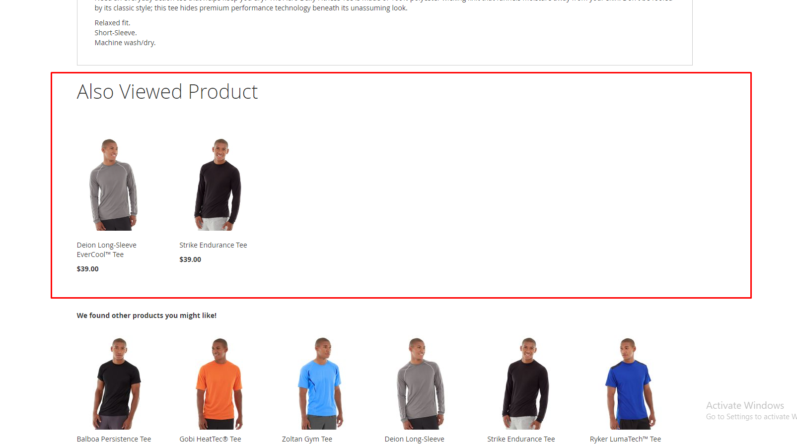
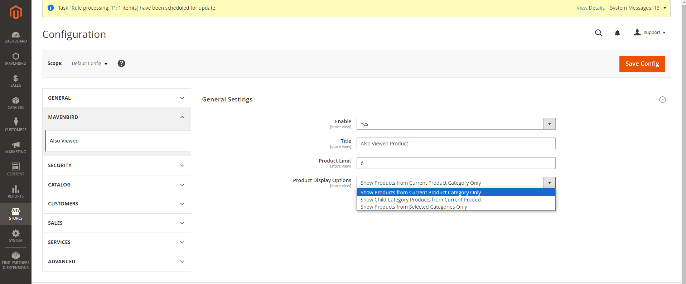

# Magento 2 Also Viewed Product Module

Enhance your Magento 2 store with the Also Viewed Product Module. This extension helps you increase customer engagement by displaying products that are frequently viewed together, encouraging additional purchases and improving the overall shopping experience.

## Also Viewed Product Module for Magento 2

### Key Features:
- **Dynamic Product Recommendations:** Automatically displays products that are often viewed together by customers.
- **Flexible Display Options:** Showcase also viewed products on product pages.
- **Customizable Widget:** Easily embed a customizable widget to display also viewed products in preferred store sections.
- **Product Limit Control:** Set the number of products to display based on your store's layout and design.
- **Category-based Display:** Choose to display products from the same category or across different categories for broader recommendations.
- **Responsive Design:** Ensures seamless display across all devices for optimized user experience.
- **Promotion Integration:** Enhance promotional campaigns by highlighting also viewed products to increase cross-sell opportunities.
- **SEO Benefits:** Improve SEO by featuring relevant products, increasing page views and dwell time.
- **Customizable Display Rules:** Define rules for displaying also viewed products based on categories, attributes, or customer segments.
- **Multi-store Support:** Configure module settings per store view or website to adapt to diverse market needs.

### Benefits:
- **Increased Sales:** Boost conversions by promoting products that are frequently viewed together, encouraging additional purchases.
- **Enhanced User Experience:** Offer customers a personalized shopping experience with relevant product recommendations.
- **Data-driven Insights:** Leverage viewing data to refine inventory management and marketing strategies.
- **Scalability:** Scale your product recommendation strategy as your store grows, accommodating new trends and customer preferences.

### Compatibility:
This module is compatible with Magento 2.x versions, ensuring seamless integration with your existing store setup.

### Installation:
Install via composer (recommended):
~~~~~~~~~~~~~~~~~~~~~~~~~~~~~~~~~~~~~~~~~~~~~~~~~
composer require mavenbird/alsoviewed
php bin/magento setup:upgrade
php bin/magento setup:di:compile
php bin/magento setup:static-content:deploy
php bin/magento cache:flush
~~~~~~~~~~~~~~~~~~~~~~~~~~~~~~~~~~~~~~~~~~~~~~~~~

## Upgrade/Update Module:
Keep your module up to date with the latest features by running:
~~~~~~~~~~~~~~~~~~~~~~~~~~~~~~~~~~~~~~~~~~~~~~~~~
composer update mavenbird/alsoviewed
php bin/magento setup:upgrade
php bin/magento setup:di:compile
php bin/magento setup:static-content:deploy
php bin/magento cache:flush
~~~~~~~~~~~~~~~~~~~~~~~~~~~~~~~~~~~~~~~~~~~~~~~~~

## Customization Options:
Customize display settings and widget configurations to align with your store's branding and marketing goals.

**Example Configuration Screenshots:**
- 
- 

## Support:
For installation, customization, or any inquiries, our dedicated support team is available.
**Email: [support@mavenbird.com](support@mavenbird.com)**

## Get Started:
Boost customer engagement and drive additional sales with the Also Viewed Product Module for Magento 2. Optimize product visibility and enhance the shopping experience effectively.
**Thank you!**
